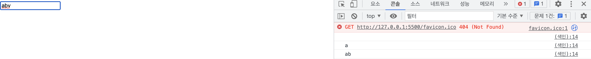
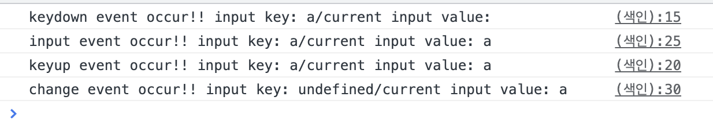

## input에 keydown 이벤트를 사용했을 때 e.target.value가 하나씩 느리게 나오는 이유

검색창을 구현하는 과정에서 input 창에 텍스트를 입력하면 input.value를 가져오도록 하려고 했다. 이때 keydown 이벤트가 발생하면 e.target.value를 가져올 수 있게 만들었다.

```jsx
<input type="text" class="input-text" />
<script>
  const $inputText = document.querySelector('.input-text');
  $inputText.addEventListener('keydown', e => {
    console.log(e.target.value);
  });
</script>
```



콘솔 창을 확인해보면 텍스트를 입력했을 때 바로 value를 보여주는 것이 아니라 맨 처음에는 빈 텍스트가 찍히고 그 다음에 입력한 텍스트 값을 가져오는 것을 볼 수 있다.

### [ 📚 keydown 이벤트는 input 요소의 ‘바뀌기 전의 값’을 반환한다. ]

그렇기 때문에 value가 변경되었을 때 변경된 요소를 반환하는 것이 아니라 이전의 값을 보여주는 것이다. 만약 이벤트 타깃을 input으로 하고, input의 value를 가지고 오고 싶다면 input 이벤트를 사용해야한다.

관련된 이벤트들(keydown, keyup, input, change)을 한 번에 비교해보자

```jsx
const $inputText = document.querySelector('.input-text');

// keydown event
$inputText.addEventListener('keydown', (e) => {
  console.log(
    'keydown event occur!!',
    `input key: ${e.key}/current input value: ${e.target.value}`
  );
});

// keyup event
$inputText.addEventListener('keyup', (e) => {
  console.log(
    'keyup event occur!!',
    `input key: ${e.key}/current input value: ${e.target.value}`
  );
});

// input event
$inputText.addEventListener('input', (e) => {
  console.log(
    'input event occur!!',
    `input key: ${e.data}/current input value: ${e.target.value}`
  );
});

// change event
$inputText.addEventListener('change', (e) => {
  console.log(
    'change event occur!!',
    `input key: ${e.data}/current input value: ${e.target.value}`
  );
});
```



a라는 텍스트를 입력했을 때, 이벤트는 keydown → input → keyup 순으로 발생한다.

input 이벤트는 input의 value가 변경되는 순간 이벤트가 발생한다.

그리고 input 요소에서 벗어나기 위해 엔터 혹은 다른 영역을 클릭했을 때 change 이벤트가 발생한다.

## Review

keydown과 keyup은 눌리고 손을 뗐을 때 이 두 차이만 있고 나머지 동작은 동일하다고 생각했었는데, 이번 기회를 통해 keydown과 keyup 이벤트의 차이점에 대해서 알게 되었다.

만약 input에 이벤트를 발생시키는 경우라면, keyboard 이벤트 대신 **input 이벤트**를 사용하자.
