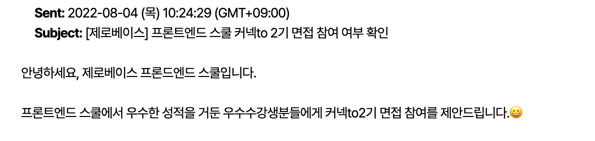

# 제로베이스 커넥to 2기를 마치며

8월 29일을 시작으로 12월 23일까지 총 4개월의 기간동안의 제로베이스 오프라인 교육이 드디어 끝났다. 뜻 깊었던 4개월을 회고해보려고한다.

커넥to는 온라인 수강생 중 우수 수강생에게 제공하는 무료 오프라인 교육이다. 내가 제로베이스라는 부트캠프를 선택한 이유도 바로 이 오프라인 교육 때문이었다. (열심히 공부하면 우수 수강생이 될 수 있지 않을까라는 막연한 생각이긴 했지만..😐)

## 메일 한 통으로 시작된 커넥to의 시작

생각지도 못한 우수 수강생 메일을 받았다. 와 나 진짜 된거야?

메일을 읽어보니 월요일부터 금요일 10to10으로 진행되며, 교육과정만 무료고 그외 교통비/숙식비 등은 본인이 부담해야한다했다. 메일을 읽고 나서 바로 든 생각은 고등학생 때도 안해본 텐투텐을 견딜 수 있을까? 내가 정말 우수 수강생인가? 다른 사람들 사이에서 너무 뒤쳐지면 어떡하지 :( 였다. _(지금 생각해보면 조금 한심한 생각이라고 느껴지지만 그 땐 그랬었지…ㅠ )_

## HTML 이렇게 어려운 거였어?

처음 한 달간은 HTML 수업이 진행되었다. 수업은 김데레사 강사님께서 진행해주셨는데 웹 접근성 분야에서 유명하신 강사님이셨다.🥺

[제로베이스 스쿨 교육 과정 블로그 : 네이버 블로그](https://blog.naver.com/fastcampus_nklcb/222405159434)

내가 생각한 HTML/CSS는 화면에 내가 원하는대로 그려지면 되는거 아닐까? 라고 생각했었는데 이게 왠걸?

모든 태그에는 목적이 있다는 걸 처음 알게되었고 CSS는 속성마다 어떤 특징을 가지고 있는지 하나하나 가르쳐주시면서 정말 어렵다라는걸 느끼게 되었다. 가장 크게 배운 건 어떠한 환경에서도 모든 사람이 사용할 수 있도록 만들어야 한다는 것이었다.

웹 접근성 그리고 최적화(Google Vitals)를 공부하면서 정말 깊이있게 공부했다라는 생각이 들었다. ‘아! 프론트엔드 개발자를 지망한다면서 이것도 모르면 안되지!’라는 생각이 들 정도로 왜 공부해야하는가에 대해서 스스로 느낄 수 있도록 강의해주셨다. 내가 봐왔던 교육자 중에 가장 책임의식을 가지고 교육을 해주신 분이 아닐까 싶을 정도로.

강의할 때는 카리스마 넘치시는 호랑이 선생님인데 강의 이외의 모습은 너무 친절하신 분이었다.

## JavaScript

정신없이 HTML/CSS 프로젝트를 끝내니 자바스크립트 수업이 다가왔다. 처음 프론트엔드 개발자가 되고싶다고 생각하고 처음 산 책이 ‘자바스크립트 Deep Dive’인데 그 책을 쓰신 분이 강의를 해주신다니…!

이건 무조건 어떻게든 수업을 따라가야겠다라는 마음을 먹고 수업을 듣기 시작했다. 처음에는 모르는 내용이 있으면 괜히 나만 모른다는 생각에 강의 시간에 질문하지 않고 조용히 지나가려고 했었는데 이 부분에 대해서 많이 혼났던 것 같다. 혼나는 건 참 슬픈 일이다. 돌이켜보니 강사님한테 무식하다는 얘기를 듣는 것보다 반 애들한테 무식하게 보이고 싶지 않았던 게 아닐까 싶다. 웅모님 덕분에 더 악바리로 공부하기로 마음먹고 정신차린 이후로는 뭐든지 물어보려고 노력했던 것 같다.

자바스크립트를 공부하면서 느꼈던 건 돌아가기만 하는 코드가 다가 아니라는 것, 돌아가게 만들었다면 그 때부터가 시작이라는 것이다. 강사님은 항상 돌아간다고 거기서 넘어갈게 아니라, 항상 가독성이 좋은 코드를 작성하기 위해 고민해야한다고 말씀해주셨다. 가독성이 좋은 코드를 만들기 위해선 자바스크립트의 기본 지식을 잘 알고 있어야 가능하다고 생각한다. 커넥to가 끝나고 나서 혼자 공부할 때에도 DeepDive 책은 반복해서 읽어야지!🙌🏻

커넥to 과정을 들을 때에는 실력이 제자리인 것 같다라는 생각을 많이 했다. 같이 공부하는 사람들을 계속해서 성장하는데.. 왜 나만 늘지않지?라는 고민이 계속해서 들었었는데 끝나고나니 나 스스로도 많이 성장했다고 느껴진다. 이전엔 혼자 어떻게 공부해야할지 항상 막막했는데 스스로 공부하는 방법을 터득한 것 같다. 이것만으로도 큰 수확이 아닐까. 힘들기도 했지만 너무 보람찬 4개월이었다!
