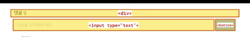

## HTML 기초

### 학습 목표

- HTML이 무엇일까?
- HTML의 구조와 문법
- 자주 사용되는 HTML 요소가 무엇일까?
- id와 class를 목적에 맞게 사용하여 사람과 컴퓨터가 읽기 쉬운 semantic HTML 문서를 작성하자.
- 시맨틱 요소엔 무엇이 있을까?
- 시맨틱 요소를 사용하는 이유는 무엇일까?

🙋🏻‍♀️ HTML이 뭐야?

: Hyper Text Markup Language의 약자. 웹페이지의 틀을 만드는 마크업 언어이다.

🙋🏻‍♂️ HTML은 어떻게 쓰는거지?

: HTML은 tag들의 집합이다. <>로 묶인 HTML의 기본 구성 요소로 사용한다. 예를 들어 `<span></span>` 과 같이 태그를 열고 닫는 방식으로 사용한다.

🙋🏻‍♂️ 무조건 여는태그와 닫는태그가 쌍으로 있어야 하는건가?

: 무조건은 아니다. img 태그와 같은 경우엔 self-closing tag로 `` 처럼 사용할 수 있다.

🙋🏻 자주 사용하는 element로는 어떤 것들이 있을까?

: 자주 사용하는 태그로는 `div`, `span`, `img`, `a`, `ul`, `ol`, `li`, `input`, `textarea`, `button` 태그가 있다.

textarea 태그는 줄바꿈이 되는 입력폼이다.

🙋🏻‍♂️ 시맨틱 요소란 무엇일까?

: HTML5에서는 시멘틱 웹이 중요시되면서 여러 시맨틱 요소가 새롭게 만들어졌다. semantic이란 ‘의미가 있는’ 이라고 해석할 수 있는데 즉, 의미를 가진 요소를 사용하는 방식을 추구한 것이다.

예를 들어서 문단의 제목을 div 태그를 사용하여 폰트사이즈를 키워서 제목처럼 보이게 만들 수 있지만, h1 태그를 사용하여 heading level 1의 의미를 주는 것과는 다르다.

🙋🏻 시맨틱 요소를 사용해야 하는 이유는 무엇일까?

: 첫 번째로 검색 엔진이 시맨틱 요소를 좋아하기 때문이다. 두 번째로는 개발자가 협업을 할 때 의미가 없는 div 태그를 탐색하는 것보다 의미있는 코드 블록을 찾는 것이 편리하기 때문이다.

🙋🏻 시맨틱 요소의 종류로는 뭐가 있을까?

`<article>`

: 독립적이고 자체 포함된 콘텐츠를 지정한다.

`<aside>`

: 본문의 주요 부분을 표시하고 남은 부분을 설명하는 요소. 사이드바나 광고창 등 중요하지 않은 부분에 사용된다.

`<footer>`

: 일반적으로 페이지나 해당 파트의 **가장 아랫부분**에 위치하며, 사이트의 라이선스, 주소, 연락처 등을 넣을 때 사용한다.

`<header>`

: 일반적으로 페이지나 해당 섹션의 **가장 윗부분**에 위치하며, 사이트의 제목이 보통 들어간다.

`<nav>`

: 내비게이션(**nav**igation)의 약자로, 일반적으로 상단바 등 사이트를 안내하는 요소에 사용한다.

`<main>`

: 문서의 주된 콘텐츠를 표시

## HTML 심화

### 학습 목표

- 웹 앱의 구조 잡기
- `<div>` 요소 또는 `<section>`, `<header>` 등의 시맨틱 요소로 영역을 구분하는 이유를 이해할 수 있다.
- HTML 문서에서 언제 id 혹은 class를 사용해야 하는지 이해할 수 있다.

🙋🏻‍♀️ 웹 앱의 구조는 어떻게 잡아야할까?

: 댓글창을 생각해보자. 크게 작성하는 영역과 읽기 영역으로 나눠져있다.

🙋🏻‍♂️ 댓글창엔 어떤 태그로 구조를 만들어야할까?




```html
<div>
  <div>댓글</div>
  <input type="text" placeholder="댓글을 입력해주세요" />
  <button></button>
</div>
```

🙋🏻‍♀️ 읽기 영역은 어떤 구조로 잡아야할까?


```html
<ul>
  <li>
    <div>
      <div>ouo***</div>
      <div>댓글...</div>
      <span>2018-03-22 23:29:22</span>
      <button>👍🏻</button>
      <button>👎🏻</button>
    </div>
  </li>
  <li>
    <div>
      <div>cake***</div>
      <div>댓글...</div>
      <span>2018-03-22 23:29:22</span>
      <button>👍🏻</button>
      <button>👎🏻</button>
    </div>
  </li>
</ul>
```

**💬 id 및 class를 목적에 맞게 사용하자**

🙋🏻‍♀️ id는 언제 쓰고 class는 언제 써야할까?

- id: 고유한 이름을 붙일 때 사용한다.
- class: 반복되는 영역을 유형별로 분류할 때 사용한다.

| HTML 태그                    | Selector            |
| ---------------------------- | ------------------- |
| `<div id=”writing-seciton”>` | div#writing-section |
| `<li class=”comment”>`       | li.comment          |

반복되는 영역은? 👉🏻 **class**를 사용하자.

🙋🏻‍♀️ id를 사용하지 않은 이유는?

: id는 고유한 이름을 붙일 때 사용한다. id를 사용하게 되면 모든 영역이 고유해야한다.


