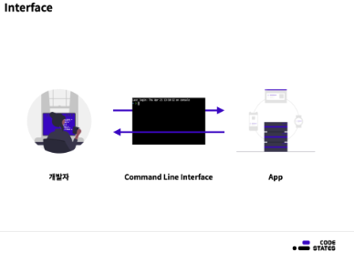
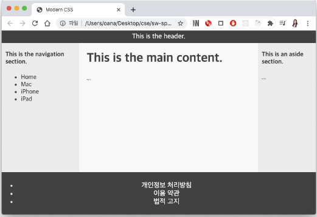
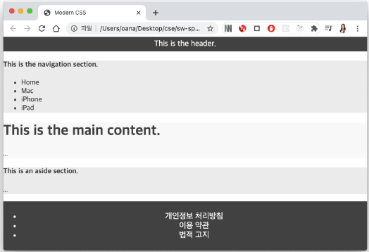
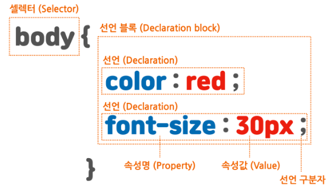
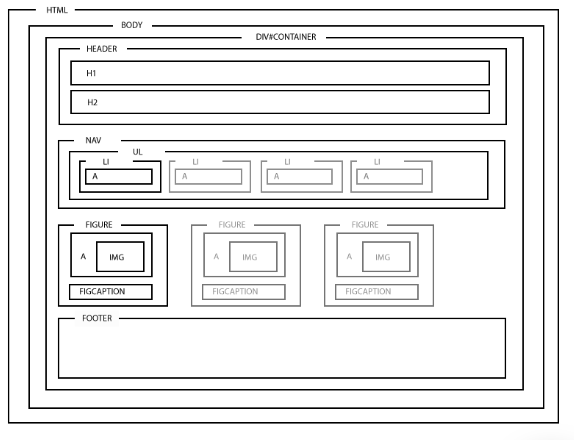
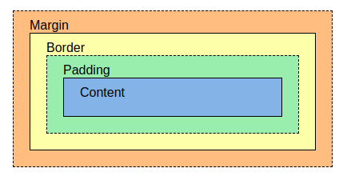
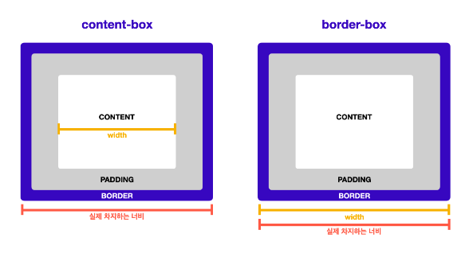

## CSS 기초

### 학습 목표

- CSS의 사용 목적을 이해한다.
- CSS의 기본 문법과 구조를 이해한다.
- CSS를 HTML에 적용하는 방법에 대해서 이해한다.
- HTML 안에 CSS를 직접 정의하는 것을 권장하지 않는 이유를 이해한다.
- CSS를 이용해 텍스트를 꾸밀 수 있다.
- CSS에서 쓰이는 단위의 두 가지 구분을 이해한다.
  - 각 단위가 적합한 경우를 구분할 수 있다.
- MDN 또는 W3School 등의 레퍼런스 사이트를 이용해 CSS 속성을 검색하고 사용할 수 있다.

### 🙋🏻‍♂️ CSS가 뭐야?

: Cascading Style Sheets로 웹 페이지 스타일 및 레이아웃을 정의하는 스타일 시트이다.

🙋🏻 CSS로 개발자는 무엇을 만드는거지?

: 웹 애플리케이션에 접근할 수 있는 사용자 인터페이스부터 만든다.

🙋🏻‍♂️ 사용자 인터페이스는 무엇을 말하는거지?

: 사용자 인터페이스에 대해서 설명하기 전 인터페이스에 대해서 알아보자.

> 인터페이스는 컴퓨터와 교류하기 위한 연결고리이다. 마우스도 없던 시대의 개발자는 자신이 만든 애플리케이션과 소통하기 위해 CLI를 사용했다. 키보드로 작성한 비밀 암호같은 코드를 적어서 엔터를 눌러야만 애플리케이션을 작동시킬 수 있었다.
>
> 

요즘엔 메세지를 보낼 때 키보드 인터페이스로 입력하고 버튼 모양의 인터페이스를 누르면 메세지가 전송이 된다. 이렇게 일반 사용자가 쉽게 사용할 수 있는 인터페이스에는 앞에 사용자를 붙여 사용자 인터페이스, UI라고 부른다.

### 💬 페이지 만들어보기



🙋🏻‍♀️ HTML 구조는 어떻게 잡아야할까?

```html
<body>
  <!-- header -->
  <header>This is the header.</header>
  <div class="container">
    <!-- nav -->
    <nav>
      <h4>This is the navigation section.</h4>
      <ul>
        <li>Home</li>
        <li>Mac</li>
        <li>iPhone</li>
        <li>iPad</li>
      </ul>
    </nav>
    <!-- main -->
    <main>
      <h1>This is the main content.</h1>
      <p>...</p>
    </main>
    <!-- aside -->
    <aside>
      <h4>This is an aside section.</h4>
      <p>...</p>
    </aside>
  </div>
  <!-- footer -->
  <footer>
    <ul>
      <li>개인정보 처리방침</li>
      <li>이용 약관</li>
      <li>법적 고지</li>
    </ul>
  </footer>
</body>
</html>
```

💬 index.css에 코드를 넣고 차이점을 확인해보자

```css
body {
  margin: 0;
  padding: 0;
  background: #fff;
  color: #4a4a4a;
}
header,
footer {
  font-size: large;
  text-align: center;
  padding: 0.3em 0;
  background-color: #4a4a4a;
  color: #f9f9f9;
}
nav {
  background: #eee;
}
main {
  background: #f9f9f9;
}
aside {
  background: #eee;
}
```



### CSS 문법 이해하기



셀렉터는 요소 이름이나 id, 또는 클래스를 선택한다.

셀렉터로 특정 요소를 선택했다면? 👉🏻 중괄호 안에서 이 요소에 적용할 내용을 작성한다.

요소에 적용할 수 있는 내용을 **속성**이라고 한다. 색상, 글자 크기 등 다양한 속성이 있으며, 속성에 적용할 적절한 값을 입력하여 스타일을 표현합니다.

그림에 나타나 있는 `color: red;`는 이 요소의 색상을 빨간색으로 스타일링한다. 속성과 값의 끝에는 세미콜론(`;`)을 붙여 속성끼리 구분한다.

🙋🏻‍♀️ 텍스트의 가운데 정렬을 하기 위한 속성은?

: `text-align: center`

🙋🏻‍♂️ 글자 색을 바꾸기 위한 속성은?

: `color`

🙋🏻‍♂️ 배경 색을 바꾸기 위한 속성은?

: `background-color`

🙋🏻 `background` 속성과 `background-color` 속성의 차이점은?

: **`background`**는 색상, 이미지, 원점, 크기, 반복 등 여러 배경 스타일을 한 번에 지정할 수 있다. background는 단축 속성으로서 하위 속성으로 background-color를 포함하고 있다.

🙋🏻‍♀️ em의 의미는 무엇인가?

: CSS에서 사용하는 상대 길위 단위이다. **상대 길위 단위**는 상위요소의 글꼴 크기 또는 viewprot 크기와 관련이 있다.

상대 단위를 사용하면? 👉🏻 텍스트나 다른 요소의 크기가 페이지의 다른 모든 것에 비례하여 조정되도록 신중하게 계획할 수 있다는 이점이 있다.

💬 각각의 div가 어떤 형태로 나타날 지 예측해보자.

```css
<div class="wrapper">
  <div class="box px">I am 200px wide</div>
  <div class="box vw">I am 10vw wide</div>
  <div class="box em">I am 10em wide</div>
</div>
```

```css
.wrapper {
  font-size: 1em;
}

.px {
  width: 200px;
}

.vw {
  width: 10vw;
}

.em {
  width: 10em;
}
```

3개의 div를 감싸고 있는 wrapper에 `font-size: 1em;` 를 적용했다. 즉, 부모 요소의 폰트 크기의 1배 사이즈로 설정한 것과 동일하다.

`div.box px` 👉🏻 200px 이라는 절대 단위를 사용했기 때문에 상위 요소의 영향을 받지 않고 width: 200px의 크기를 가진 div로 나타난다.

`div.box vw` 👉🏻 vw는 viewport 너비 단위로 설정된다. 이 값은 viewport 너비를 기준으로 하므로 10vw는 viewport 너비의 10%이다. 브라우저 창의 너비를 변경하면 박스의 크기가 변경될 것이다.

`div.box em` 👉🏻 em은 글꼴 크기에 상대적이다. `.wrapper`의 font-size가 부모요소(현재 root) 글꼴 크기이므로 width는 글꼴 크기의 10배이다.

### 💬 단위에 대해서 알아보기

**글꼴 사이즈를 정할 때**

🔨 **기기나 브라우저 사이즈 등의 환경에 영향을 받지 않는 절대적인 크기로 정하는 경우**
: `px`(픽셀)을 사용. 픽셀은 크기가 고정된 절대 단위이기 때문에 사용자 접근성이 불리하다.

글꼴의 크기를 픽셀로 설정하면, 작은 글씨를 보기 힘든 사용자가 브라우저의 기본 글꼴 크기를 더 크게 설정하더라도 글꼴의 크기는 항상 설정된 픽셀로 고정된다.

개발자가 제목(heading)을 강조하기 위해 픽셀을 이용해 글꼴의 크기를 지정했으나 사용자의 환경에 따라 일반 텍스트보다 작게 보이는 결과를 초래할 수 있다. 그리고 픽셀은 모바일 기기처럼 작은 화면이면서, 동시에 고해상도인 경우에도 적합하지 않다.

기본적으로 고해상도에서는 1px이 모니터의 한 점보다 크게 업스케일(upscale) 되기 때문에, 뚜렷하지 못한 형태로 출력되는 경우도 있다.

**🔨 일반적인 경우**
: 상대 단위인 `rem`을 사용한다. **root의 글자 크기**, 즉 브라우저의 기본 글자 크기가 1rem이며, 두 배로 크게 하고 싶다면 2rem, 작게 하려면 0.8rem 등으로 조절해서 사용할 수 있다.

이는 사용자가 설정한 기본 글꼴 크기를 따르므로, **접근성에 유리**하다. (`em`은 부모 엘리먼트에 따라 상대적으로 크기가 변경되므로 계산이 어렵지만 `rem`은 root의 글자 크기에 따라서만 상대적으로 변합니다.)

**화면 사이즈를 정할 때**

**✍🏻  반응형 웹(responsive web)에서 기준점을 만들 때**

: 데스크탑에서 볼 때, 스마트폰에서 세로 모드로 볼 때, 가로 모드로 볼 때, 태블릿으로 볼 때가 각각 달라야한다. 이 때에는 디바이스 크기별로 CSS를 달리 적용해야 한다.

이때, 디바이스 크기를 나누는 기준은 보통 `px`로 정한다.

**✍🏻 화면 너비나 높이에 따른 상대적인 크기가 중요한 경우**

: 이때에는 `vw`, `vh`를 사용한다.

---

## 박스 모델 기초

### 학습 목표

- CSS 박스 모델을 이해할 수 있다.
- 박스를 구성하는 네 가지 요소를 구분하고 각각에 대해 설명할 수 있다.
  - margin, border, padding, content
- 박스 크기를 측정하는 두 가지 기준의 차이를 이해할 수 있다.

### 💬 모든 콘텐츠는 고유한 영역이 있다.



```html
<h1>Basic document flow</h1>
<p>
  I am a basic block level element. My adjacent block level elements sit on new
  lines below me.
</p>
<p>
  By default we span 100% of the width of our parent element, and we are as tall
  as our child content. Our total width and height is our content + padding +
  border width/height.
</p>
<p>
  We are separated by our margins. Because of margin collapsing, we are
  separated by the width of one of our margins, not both.
</p>
<p>
  inline elements <span>like this one</span> and <span>this one</span> sit on
  the same line as one another, and adjacent text nodes, if there is space on
  the same line. Overflowing inline elements will
  <span>wrap onto a new line if possible (like this one containing text)</span>,
  or just go on to a new line if not
</p>
```

```css
h1 {
  background: gray;
  width: 60%;
}

p {
  background: rgba(255, 84, 104, 0.3);
  width: 80%;
  height: 200px;
}

span {
  background: yellow;
  width: 100px;
  height: 100px;
}
```

🙋🏻 위 HTML에서 줄 바꿈이 적용되는 요소는 무엇일까?

: 줄 바꿈이 적용되는 요소로는 h1, p 태그가 있다.

🙋🏻 위 CSS 코드에서 실제로 작동하지 않는 것이 존재한다. 무엇일까?

: span에 width, height 속성을 주었지만, 작동하지 않는다. span은 inline 요소로서 width, height를 가지지 않고 컨텐츠 크기만큼만 크기를 가진다.

### 💬 block vs. inline vs. line-block

|                              | block | inline               | inline-block         |
| ---------------------------- | ----- | -------------------- | -------------------- |
| 줄 바꿈 여부                 | O     | X                    | X                    |
| 기본적으로 갖는 너비(width)  | 100%  | 글자가 차지하는 만큼 | 글자가 차지하는 만큼 |
| width, height 사용 가능 여부 | 가능  | 가능                 | 불가능               |

### 💬 박스를 구성하는 요소



### 🙋🏻‍♀️ 박스를 벗어나는 콘텐츠는 어떻게 처리해야할까?

박스 크기보다 콘텐츠 크기가 더 큰 경우에는 콘텐츠가 박스 바깥으로 빠져나온다. 이런 경우 박스 크기에 맞게 콘텐츠를 더 이상 표시하지 않거나, 박스 안에 스크롤을 추가하여 콘텐츠를 확인할 수 있게 만든다.

```css
p {
  height: 40px;
  overflow: auto;
}
```

`overflow` 속성의 `auto` 값은, 콘텐츠가 넘치는 경우 스크롤을 생성하도록 한다.

🙋🏻‍♂️ 넘치는 내용을 보여주고 싶지 않다면? 👉🏻 `overflow: hidden;`

### 💬 \***\*박스 크기 측정 기준\*\***

```html
<div id="container">
  <div id="inner">안쪽 box</div>
</div>
```

```css
#container {
  width: 300px;
  padding: 10px;
  background-color: yellow;
  border: 2px solid red;
}

#inner {
  width: 100%;
  height: 200px;
  border: 2px solid green;
  background-color: lightgreen;
  padding: 30px;
}
```

🙋🏻‍♀️ 현재 `#container` 너비는 얼마일까?

: `#container`의 너비는 300px이 아니라, 324px이다.

```css
300px (콘텐츠 영역)
+ 10px (padding-left)
+ 10px (padding-right)
+ 2px (border-left)
+ 2px (border-right)
```

🙋🏻‍♂️ 이런 현상이 발생하는 이유는 무엇일까?

: 박스의 크기를 측정하는 기본 값이 `content-box` 이기 때문이다. content-box는 border와 padding을 고려하지 않고 박스 크기를 결정한다.

🙋🏻‍♂️ 이를 해결하기 위한 방법은 뭐가 있을까?

```css
* {
  box-sizing: border-box;
}
```



---

## \***\*CSS Selector\*\***

### 학습 목표

- 다양한 CSS selector 규칙을 이해한다.
- 후손 selector와 자식 selector의 차이를 이해한다.
- 필요시 검색을 통해 필요한 selector를 찾아 적용할 수 있다.

### 💬 **attribute 셀렉터**

attribute 셀렉터는 같은 속성을 가진 요소를 선택

```css
a[href] {
}
p[id='only'] {
}
p[class~='out'] {
}
p[class|='out'] {
}
section[id^='sect'] {
}
div[class$='2'] {
}
div[class*='w'] {
}
```

### 💬 **자식 셀렉터**

자식 셀렉터는 첫 번째로 입력한 요소의 바로 아래 자식인 요소를 선택

```css
header > p {
}
```

이 경우 `<header>` 요소 바로 아래에 있는 두 개의 `<p>` 요소는 선택되지만, `<span>` 요소의 자식인 `<p>` 요소는 선택되지 않는다.

```html
<header>
  <p>
    <!-- 선택 -->
    <span>
      <p></p>
    </span>
  </p>
  <p>
    <!-- 선택 -->
    <span>
      <p></p>
    </span>
  </p>
</header>
```

### 💬 **후손 셀렉터**

후손 셀렉터는 첫 번째로 입력한 요소의 후손을 선택

```css
header p {
}
```

이 경우 `<header>` 요소의 자식인 `<p>` 요소뿐 아니라, `<header>` 요소의 자식의 자식인 `<p>` 요소까지 모두 선택된다.

```html
<header>
  <p>
    <!-- 선택 -->
    <span>
      <p><!-- !!선택!! --></p>
    </span>
  </p>
  <p>
    <!-- 선택 -->
    <span>
      <p><!-- !!선택!! --></p>
    </span>
  </p>
</header>
```

### 💬 형제 **셀렉터**

부모 요소를 공유하면서, 첫 번째 입력한 요소 뒤에 오는 두 번째 입력한 요소를 모두 선택

```css
section ~ p {
}
```

```html
<header>
  <section></section>
  <p></p>
  <!-- 선택 -->
  <p></p>
  <!-- 선택 -->
  <p></p>
  <!-- 선택 -->
</header>
```

### 💬 인접 형제 **셀렉터**

같은 부모 요소를 공유하면서, 첫 번째 입력한 요소 바로 뒤에 오는 두 번째 입력한 요소를 선택

```css
section + p {
}
```

```html
<header>
  <section></section>
  <p></p>
  <!-- 선택 -->
  <p></p>
  <p></p>
</header>
```

### 💬 가상 클래스 **셀렉터**

```css
a:link {
} /*사용자가 방문하지 않은 <a>요소를 선택합니다.*/
a:visited {
} /*사용자가 방문한 <a>요소를 선택합니다. */
a:hover {
} /* 마우스를 요소 위에 올렸을 때 선택합니다. */
a:active {
} /* 활성화 된(클릭된) 상태일 때 선택합니다. */
a:focus {
} /* 포커스가 들어와 있을 때 선택합니다. */
```

### 💬 UI 요소 상태 **셀렉터**

```css
input:checked + span {
} /*체크 상태일 때 선택합니다. */
input:enabled + span {
} /*사용 가능한 상태일 때 선택합니다. */
input:disabled + span {
} /*사용 불가능한 상태일 때 선택합니다. */
```

### 💬 구조 가상 클래스 **셀렉터**

```css
p:first-child {
}
ul > li:last-child {
}
ul > li:nth-child(2n) {
}
section > p:nth-child(2n + 1) {
}
ul > li:first-child {
}
li:last-child {
}
div > div:nth-child(4) {
}
div:nth-last-child(2) {
}
section > p:nth-last-child(2n + 1) {
}
p:first-of-type {
}
div:last-of-type {
}
ul:nth-of-type(2) {
}
p:nth-last-of-type(1) {
}
```

### 💬 부정 셀렉터

```css
input:not([type='password']) {
}
div:not(:nth-of-type(2)) {
}
```

### 💬 적합성 확인 셀렉터

```css
input[type='text']:valid {
}
input[type='text']:invalid {
}
```
